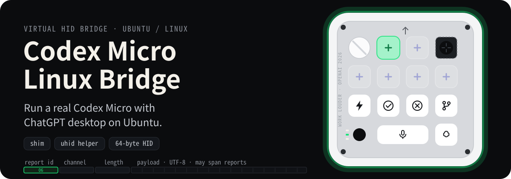
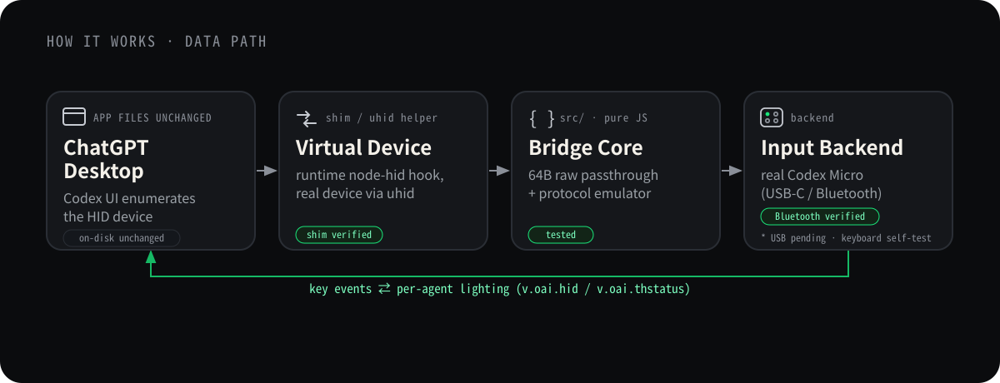

<p align="center"><sub><b>English</b> · <a href="./README_JP.md">日本語</a></sub></p>

<h1 align="center">Codex Micro Linux Bridge</h1>

<p align="center">
  
</p>

<p align="center">
  <sub>The device on the right of the hero is a faithful top-down specimen of the real Codex Micro (the edge and key glow follow the per-agent status color). There is no Linux screenshot of the physical device yet, so treat it as a conceptual diagram.</sub>
</p>

<p align="center">
  
  
  
  
</p>

Codex Micro Linux Bridge connects a Work Louder × OpenAI **Codex Micro** (`kbd-1.0-codex-micro`) to a **ChatGPT desktop runtime on Ubuntu**. On the verified Bluetooth path, it forwards the physical keyboard's HID reports through a virtual device, so the controls and RGB status lights can work without rewriting the installed desktop application. USB discovery is implemented, but the USB cable path has not yet been validated on hardware.

> [!IMPORTANT]
> This is an experimental community interoperability project, not an official Linux client. The physical Bluetooth path was validated end to end on Ubuntu 24.04 on July 25, 2026. Desktop updates, account rollout, and other Linux distributions may behave differently.

## 🧭 How it works

The installed ChatGPT desktop files stay **unmodified**. In Shim mode, the desktop must be launched through this project so a runtime-only `node-hid` hook can expose the virtual Codex Micro. Nothing is copied into or rewritten under the desktop installation directory.

The bridge core (`src/`) is transport-agnostic: it handles the protocol and fixed 64-byte HID reports. The same core is reused behind two ways of exposing the device:

- **Shim** — hooks `node-hid` through `NODE_OPTIONS` for the lifetime of the launched process. No installed app file or code signature is touched.
- **uhid helper** — creates a real HID device with Linux `uhid` and talks to the core over a Unix domain socket. Requires `sudo`.

<p align="center">
  
</p>

## 🎛️ What the device conveys

Even through the virtual device, the physical controls and RGB stay wired to Codex state.

- **Agent keys (×6):** follow chats; each key's RGB shows the assigned chat state.
- **Rotary dial:** navigate composer controls or adjust reasoning effort.
- **Analog stick:** launch four configurable actions or skills.
- **Command keys:** run configurable actions such as approve, decline, push-to-talk, or continue in a new chat.

The agent-key colors are the packed RGB values the app pushes via `v.oai.thstatus`, painted as-is.

- **Idle** (`idle`): white, `0xFFFFFF`
- **Thinking** (`working`): blue, `0x304FFE`
- **Complete** (`unread`): green, `0x00FF4C`
- **Needs input** (`awaiting-*`): amber, `0xFF6D00`
- **Error** (`error` / `failed`): red/pink, `0xFF0033`

## 🚀 Quick start

### Path A — Physical Codex Micro over Bluetooth + Shim

Install the build dependencies and project packages:

```bash
sudo apt update
sudo apt install build-essential libusb-1.0-0-dev libudev-dev
npm install
```

Install the narrowly scoped `udev` rule, reload it, then reconnect the keyboard. The rule matches the confirmed Codex Micro VID/PID (`303A:8360`) on the Linux USB or Bluetooth HID bus. Its Bluetooth permissions were verified on hardware; the USB rule is implemented but not yet hardware-validated.

```bash
sudo install -m 0644 udev/60-codex-micro.rules /etc/udev/rules.d/60-codex-micro.rules
sudo udevadm control --reload-rules
sudo udevadm trigger --subsystem-match=hidraw
bluetoothctl connect YOUR_CODEX_MICRO_ADDRESS
```

Start the bridge first. It auto-detects the current Codex Micro vendor `hidraw` node:

```bash
node bin/codex-micro-emulator.js --mode shim --input codex-micro --verbose
```

Expected startup output includes:

```text
Listening for the node-hid shim on /tmp/codex-micro-vhid.sock.
Physical Codex Micro ready at /dev/hidrawN.
```

In another terminal, launch the desktop through the Shim:

```bash
CHATGPT_APP=/usr/bin/chatgpt-desktop ./shim/launch-chatgpt-linux.sh
```

> [!NOTE]
> Shim mode requires the `EnableNodeOptionsEnvironmentVariable` fuse to be enabled in the Electron build you use.

#### If the Codex Micro settings are hidden

If the desktop build contains the Codex Micro code but its settings are hidden, fully quit the normally launched desktop and use the optional validation launcher:

```bash
CHATGPT_APP=/usr/bin/chatgpt-desktop ./shim/launch-chatgpt-linux-forced.sh
```

The launcher serves a temporary, in-memory-patched copy of the relevant client assets from localhost. It does not modify anything under `/opt` or any other desktop installation path, and the overlay stops when the app exits. This unsupported validation path does not change server-side account entitlement and fails closed when the expected client gate cannot be found.

> [!TIP]
> Bluetooth reconnection can change `/dev/hidrawN`. Waiting and node rediscovery are implemented, covered by automated transport tests, and were observed in the user service on the tested Ubuntu machine. A full key/RGB regression after every reconnect is not automated. Avoid pinning `--device` during normal use because an explicit path disables renumbering discovery.

#### Start the bridge automatically at login

Install the included systemd user service. It requires no `sudo`, starts at login, waits while the keyboard is absent, and restarts the bridge after an unexpected failure:

```bash
./scripts/install-user-service.sh
```

Inspect its status and follow its logs with:

```bash
systemctl --user status codex-micro-bridge.service
journalctl --user -u codex-micro-bridge.service -f
```

The service supervises the physical bridge only. Launch ChatGPT Desktop through `launch-chatgpt-linux.sh` or `launch-chatgpt-linux-forced.sh` after login so the app loads the Shim. To remove the service:

```bash
./scripts/uninstall-user-service.sh
```

### Path B — Keyboard self-test (no hardware, no `sudo`)

> [!WARNING]
> This is an alternative development and testing idea, not a validated end-user path. The Shim and RPC building blocks have automated coverage, but the `KeyboardInput` path and its full ChatGPT Desktop E2E flow have not been verified. The commands below are provided for experimentation.

This path is intended to exercise the Shim and protocol without a physical Codex Micro:

```bash
node bin/codex-micro-emulator.js --mode shim --input keyboard --verbose
```

In another terminal:

```bash
CHATGPT_APP=/path/to/chatgpt ./shim/launch-chatgpt-linux.sh
```

To check launcher configuration without starting the desktop:

```bash
CHATGPT_APP=/bin/true ./shim/launch-chatgpt-linux.sh --dry-run
```

### Path C — `uhid` helper

> [!WARNING]
> This is an alternative architecture prototype, not a validated setup. The helper has only been checked for warning-free compilation and shell-script syntax; actual `/dev/uhid` device creation, socket report forwarding, and ChatGPT Desktop recognition have not been verified. Linux `uhid` also cannot expose the expected Manufacturer string, so desktop recognition may fail.

```bash
sudo modprobe uhid
npm run build:native:linux
./scripts/start-linux.sh --input keyboard
```

To start the two processes by hand:

```bash
sudo native/CodexMicroVirtualHIDLinux/CodexMicroVirtualHIDLinux /tmp/codex-micro-vhid.sock
```

```bash
node bin/codex-micro-emulator.js --mode helper --input keyboard
```

`npm run build:native` detects the OS and builds the same helper.

## 📋 Requirements

- Ubuntu Linux
- Node.js 18+ and npm
- A Codex Micro for the physical bridge path
- A Linux build of the ChatGPT desktop that includes the Codex integration
- A C compiler, plus `libusb` and `libudev` development packages
- The Linux `uhid` kernel module for the helper path

```bash
sudo apt update
sudo apt install build-essential libusb-1.0-0-dev libudev-dev
```

## ⚙️ Configuration

Main environment variables:

- `CHATGPT_APP` — path to the ChatGPT desktop binary
- `CODEX_MICRO_SOCKET` — Unix domain socket used by the shim / helper (default `/tmp/codex-micro-vhid.sock`)
- `CODEX_MICRO_SHIM_LOG` — where the shim writes its log
- `XDG_STATE_HOME` — XDG state dir that sets the default shim log location
- `CC` — C compiler used to build the Linux helper

Supported CLI options for the Linux bridge paths documented above:

```text
--mode <helper|shim>
--socket <path>
--input <keyboard|codex-micro>
--device </dev/hidrawN>
--battery <0-100>
--verbose
--help
```

The CLI still accepts a legacy development-input backend used by the inherited emulator tests. It is outside the supported Codex Micro Linux Bridge paths and is intentionally not documented as a user-facing input option.

## 🧩 Components

- `bin/codex-micro-emulator.js` — CLI entry point
- `src/emulator.js` — JSON-RPC state machine
- `src/framing.js` — 64-byte HID report split / reassembly
- `src/link.js` — binds an emulator to a transport
- `src/protocol.js` / `states.js` / `mapping.js` / `keycaps.js` / `renderer.js` — protocol constants, state colors, layout, rendering
- `src/transports/socket.js` — connect to the helper
- `src/transports/socket-server.js` — listen for the shim
- `src/transports/hidraw.js` — discover and open the physical USB/Bluetooth Codex Micro
- `src/raw-bridge.js` — transparent raw-report forwarding between the app and hardware
- `src/transports/loopback.js` — in-memory transport for tests
- `shim/launch-chatgpt-linux.sh` — Linux launch script for the ChatGPT desktop
- `shim/launch-chatgpt-linux-forced.sh` — temporary client-side feature-gate launcher
- `scripts/force-codex-micro-webview.mjs` — read-only patched webview overlay server
- `systemd/codex-micro-bridge.service.in` — systemd user-service template
- `scripts/install-user-service.sh` / `uninstall-user-service.sh` — install or remove the login service
- `shim/patch.cjs` / `shim/preload.cjs` — `node-hid` patch and injection
- `native/CodexMicroVirtualHIDLinux/main.c` — Linux `uhid` helper
- `scripts/start-linux.sh` — integrated launch of helper + bridge
- `udev/` — scoped raw-device access rules

## 🧪 Testing

```bash
npm test
npm run build:native:linux
```

Currently covered by automated tests:

- Codex Micro JSON-RPC and HID framing (no-terminator / multi-report / back-to-back JSON reassembly included)
- Device detection and round-trip over the shim
- Legacy emulator input-mapping handlers (not the `KeyboardInput` / desktop E2E path)
- Bash syntax of the Linux launch scripts and the shim dry-run
- Linux CLI defaults and input validation
- USB/Bluetooth HID bus matching, report normalization, transparent forwarding, and simulated node rediscovery
- Warning-free compilation of the Linux C helper

Not automated (validated manually where noted):

- Live raw-report exchange with a physical Codex Micro (Bluetooth verified on Ubuntu 24.04)
- Recognition in a Linux ChatGPT desktop runtime (Shim path verified)
- Differences across Linux distributions

## 🚧 Scope and status

- ✅ JSON-RPC and 64-byte framing: verified by automated tests.
- ✅ Shim path: implemented and manually verified with the Linux desktop runtime.
- 🧪 Keyboard self-test: implemented as an alternative development path; `KeyboardInput` and desktop E2E remain unverified.
- ✅ Physical raw HID passthrough: USB/Bluetooth HID bus matching implemented; Bluetooth manually verified.
- ✅ Physical device + desktop E2E: verified over Bluetooth on Ubuntu 24.04.
- ✅ Scoped Codex Micro `udev` rules: VID/PID and Bluetooth HID bus verified on hardware.
- 🧪 Linux `uhid` helper: compiles with strict warnings enabled; runtime device creation, socket forwarding, and desktop recognition remain unverified.
- 🧪 USB cable path and Linux distributions other than the tested Ubuntu environment: not yet validated on hardware.

> [!WARNING]
> Linux's `uhid_create2_req` has no Manufacturer field. If the ChatGPT desktop filters devices by the Manufacturer string (`Work Louder`), a helper-created virtual device may go unrecognized.

> [!NOTE]
> `udev/60-codex-micro.rules` is limited to the confirmed VID/PID and the USB
> (`0003`) or Bluetooth (`0005`) HID bus. It grants `0660` access only through
> `plugdev` and the active-seat `uaccess` tag; it never makes hidraw world-writable.

## 🛠️ Troubleshooting

### The Codex Micro does not appear on Linux

- Confirm the USB cable carries data, not just power.
- Plug directly into a different USB port.
- Check the VID/PID with `lsusb`.
- Check `dmesg` for USB enumeration errors.
- For Bluetooth, run `bluetoothctl info YOUR_CODEX_MICRO_ADDRESS` and confirm `Connected: yes`.

### Connection interrupted after Bluetooth reconnect

- Bluetooth can re-enumerate the vendor interface under a new `/dev/hidrawN` path.
- Keep `codex-micro-emulator.js` running; it waits for the device and automatically selects the new node.
- Do not use an explicit `--device /dev/hidrawN` value when automatic renumbering recovery is required.

### The ChatGPT desktop does not detect the device

- Start the bridge first.
- Launch the ChatGPT desktop via `launch-chatgpt-linux.sh`, not normally.
- Confirm `CHATGPT_APP` points at the executable.
- Check the Electron fuse settings.
- Confirm `CODEX_MICRO_SOCKET` matches in both processes.
- Check the shim log.
- If the device connects but the settings remain hidden, try the optional `launch-chatgpt-linux-forced.sh` validation path.

### `/dev/uhid` does not exist

```bash
sudo modprobe uhid
ls -l /dev/uhid
```

On kernels that do not provide `uhid`, use the shim path.

### Cannot connect to the helper

- Start the helper before the Node.js bridge.
- Use the same socket path in both processes.
- Check for stale helper processes or socket files.
- Let `./scripts/start-linux.sh --input keyboard` manage the start order.

## 🔐 Security

- Do not expose the USB HID device to all users.
- Create `udev` rules only after confirming the real VID/PID.
- The helper chowns its socket back to the invoking (`sudo`) user.
- The launch scripts do not kill existing ChatGPT desktop processes.
- The shim does not rewrite app files, but it loads code into the app's process.
- Verify the source and contents of any Linux ChatGPT build before using it.

## 📚 Further reading

- [Official Codex Micro guide](https://learn.chatgpt.com/docs/features/codex-micro)
- [Development & protocol notes (the asymmetric framing, etc.)](./DEVELOPMENT.md)
- [License](./LICENSE)

## ⚖️ License and disclaimer

This project exists for interoperability research. It is not affiliated with, endorsed by, or supported by OpenAI or Work Louder. `Codex` and `Codex Micro` are trademarks of their respective owners.

Licensed under the [MIT License](./LICENSE).
