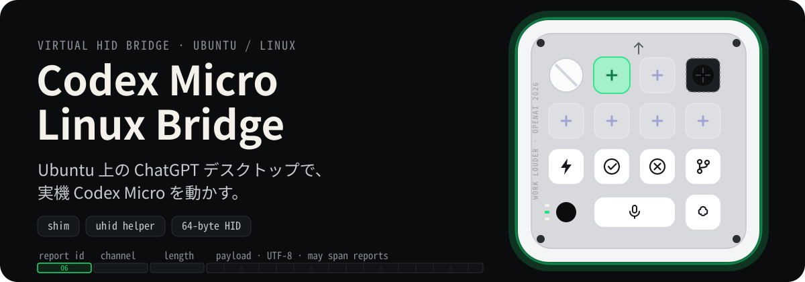
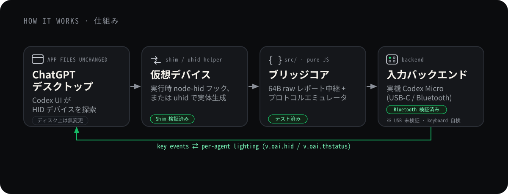

<p align="center"><sub><a href="./README.md">English</a> · <b>日本語</b></sub></p>

<h1 align="center">Codex Micro Linux Bridge</h1>

<p align="center">
  
</p>

<p align="center">
  <sub>ヒーロー右側は実機 Codex Micro の上面レイアウトを再現した見本です（縁とキーの発光はエージェントの状態色）。Linux 実機でのスクリーンショットは未掲載のため、概念図として扱ってください。</sub>
</p>

<p align="center">
  
  
  
  
</p>

Codex Micro Linux Bridge は、Work Louder × OpenAI の **Codex Micro**（`kbd-1.0-codex-micro`）を、**Ubuntu 上の ChatGPT デスクトップ実行環境**へ接続するブリッジです。動作確認済みのBluetooth経路では、実機のHIDレポートを仮想デバイス経由で中継し、インストール済みDesktopを書き換えずに物理コントロールとRGB状態表示を利用できます。USB検出は実装済みですが、USBケーブル経路は実機未検証です。

> [!IMPORTANT]
> 本プロジェクトは実験的なコミュニティ製相互運用ツールであり、公式Linuxクライアントではありません。Ubuntu 24.04上のBluetooth経路は、2026年7月25日に実機からDesktopまで動作確認済みです。Desktop更新、アカウントへの段階配信、Linuxディストリビューションの違いにより挙動が変わる可能性があります。

## 🧭 仕組み

インストール済みChatGPT Desktopのファイルは**無改変**です。Shim経路では、このプロジェクトのランチャーからDesktopを起動し、実行中のプロセスだけに`node-hid`フックを適用して仮想Codex Microを見せます。Desktopのインストール先へファイルをコピーしたり、既存ファイルを書き換えたりしません。

ブリッジコア（`src/`）はトランスポート非依存で、プロトコルと固定64バイトのHIDレポートを扱います。同じコアを2つの公開方法で使い回します。

- **Shim** — `NODE_OPTIONS` 経由で、起動したプロセスの実行中だけ`node-hid`をフックします。インストール済みアプリのファイルとコード署名には触れません。
- **uhid helper** — Linux の `uhid` で実体の HID デバイスを生成し、Unix ドメインソケット越しにコアと通信します。`sudo` が必要です。

<p align="center">
  
</p>

## 🎛️ 実機が伝えること

仮想デバイス越しでも、実機の物理コントロールと RGB は Codex の状態と結びつきます。

- **エージェントキー（×6）：** チャットを追跡し、各キーのRGBで割り当て先の状態を表示します。
- **ロータリーダイヤル：** Composerの操作項目を移動するか、推論レベルを調整します。
- **アナログスティック：** 4方向へ割り当てたアクションやスキルを起動します。
- **コマンドキー：** 承認、却下、プッシュトゥトーク、新しいチャットへの継続など、割り当てたアクションを実行します。

エージェントキーの発色は、アプリが `v.oai.thstatus` で送る packed RGB をそのまま反映します。

- **待機**（`idle`）：白、`0xFFFFFF`
- **思考中**（`working`）：青、`0x304FFE`
- **完了**（`unread`）：緑、`0x00FF4C`
- **入力待ち**（`awaiting-*`）：橙、`0xFF6D00`
- **エラー**（`error` / `failed`）：赤／桃、`0xFF0033`

## 🚀 クイックスタート

### 経路A — 実機Codex Micro（Bluetooth）+ Shim

ビルド依存パッケージとプロジェクトのパッケージをインストールします。

```bash
sudo apt update
sudo apt install build-essential libusb-1.0-0-dev libudev-dev
npm install
```

限定された`udev`ルールをインストールして再読み込みし、キーボードを再接続します。このルールは、確認済みCodex MicroのVID/PID（`303A:8360`）と、LinuxのUSB／Bluetooth HIDバスに限定して一致します。Bluetoothの権限は実機確認済みです。USB用ルールは実装済みですが、実機未検証です。

```bash
sudo install -m 0644 udev/60-codex-micro.rules /etc/udev/rules.d/60-codex-micro.rules
sudo udevadm control --reload-rules
sudo udevadm trigger --subsystem-match=hidraw
bluetoothctl connect YOUR_CODEX_MICRO_ADDRESS
```

先にブリッジを起動します。現在のCodex Micro Vendor `hidraw`ノードは自動検出されます。

```bash
node bin/codex-micro-emulator.js --mode shim --input codex-micro --verbose
```

起動時に次のような出力が表示されます。

```text
Listening for the node-hid shim on /tmp/codex-micro-vhid.sock.
Physical Codex Micro ready at /dev/hidrawN.
```

別のターミナルで、DesktopをShim経由で起動します。

```bash
CHATGPT_APP=/usr/bin/chatgpt-desktop ./shim/launch-chatgpt-linux.sh
```

> [!NOTE]
> Shim モードでは、利用する Electron ビルドの `EnableNodeOptionsEnvironmentVariable` fuse が有効である必要があります。

#### Codex Micro設定が表示されない場合

DesktopビルドにCodex Microコードが含まれていても設定が非表示の場合は、通常起動中のDesktopを完全に終了してから、任意の検証用ランチャーを使います。

```bash
CHATGPT_APP=/usr/bin/chatgpt-desktop ./shim/launch-chatgpt-linux-forced.sh
```

このランチャーは、対象クライアント資産をメモリ上で一時変更したコピーとしてlocalhostから配信します。`/opt`やその他のDesktopインストール先は変更せず、Desktop終了時にオーバーレイも停止します。非公式の検証用経路であり、サーバー側のアカウント権限は変更しません。対象フラグを検出できない場合は安全側に倒して起動前に失敗します。

> [!TIP]
> Bluetooth再接続後は`/dev/hidrawN`の番号が変わることがあります。実機待機とノード再検出は実装済みで、トランスポートの自動テストと、検証したUbuntu環境のユーザーサービス上で再検出を確認しています。再接続後の全キー／RGB操作を毎回確認するテストは自動化していません。明示的なパス指定は番号変更の検出を無効にするため、通常利用では`--device`を固定しないでください。

#### ログイン時にbridgeを自動起動する

同梱のsystemdユーザーサービスをインストールします。`sudo`は不要です。ログイン時に起動し、実機が未接続の間は待機し、予期しない終了時にはbridgeを再起動します。

```bash
./scripts/install-user-service.sh
```

状態とログは次のコマンドで確認できます。

```bash
systemctl --user status codex-micro-bridge.service
journalctl --user -u codex-micro-bridge.service -f
```

サービスが常駐させるのは物理bridgeだけです。DesktopへShimを読み込ませるため、ログイン後に`launch-chatgpt-linux.sh`または`launch-chatgpt-linux-forced.sh`でDesktopを起動してください。サービスを削除する場合:

```bash
./scripts/uninstall-user-service.sh
```

### 経路B — キーボード自検（ハードウェア・`sudo`不要）

> [!WARNING]
> これは別の考え方として残している開発・テスト案であり、検証済みのユーザー向け経路ではありません。ShimとRPCの基盤部分には自動テストがありますが、`KeyboardInput`経路とChatGPT DesktopまでのE2Eは未検証です。以下のコマンドは実験用です。

実機なしでShimとプロトコル経路を動かすことを意図した経路です。

```bash
node bin/codex-micro-emulator.js --mode shim --input keyboard --verbose
```

別のターミナルで起動します。

```bash
CHATGPT_APP=/path/to/chatgpt ./shim/launch-chatgpt-linux.sh
```

Desktopを起動せず設定だけを確認する場合:

```bash
CHATGPT_APP=/bin/true ./shim/launch-chatgpt-linux.sh --dry-run
```

### 経路C — `uhid` Helper

> [!WARNING]
> これは別のアーキテクチャ案として実装したプロトタイプであり、検証済みの構成ではありません。確認済みなのはHelperの警告なしコンパイルとシェルスクリプトの構文だけです。実際の`/dev/uhid`デバイス生成、ソケットでのレポート中継、ChatGPT Desktopでの認識は未検証です。また、Linux `uhid`では期待されるManufacturer文字列を公開できないため、Desktopが認識しない可能性があります。

```bash
sudo modprobe uhid
npm run build:native:linux
./scripts/start-linux.sh --input keyboard
```

個別に起動する場合:

```bash
sudo native/CodexMicroVirtualHIDLinux/CodexMicroVirtualHIDLinux /tmp/codex-micro-vhid.sock
```

```bash
node bin/codex-micro-emulator.js --mode helper --input keyboard
```

`npm run build:native` でも OS を判定して同じ helper をビルドできます。

## 📋 必要環境

- Ubuntu Linux
- Node.js 18 以降 と npm
- 実機ブリッジ経路を使う場合はCodex Micro本体
- Codex 統合を含む ChatGPT デスクトップの Linux 実行環境
- C コンパイラ、`libusb` および `libudev` 開発パッケージ
- Helper 経路を使う場合は Linux `uhid` カーネルモジュール

```bash
sudo apt update
sudo apt install build-essential libusb-1.0-0-dev libudev-dev
```

## ⚙️ 設定

主な環境変数:

- `CHATGPT_APP` — ChatGPT デスクトップ実行ファイルのパス
- `CODEX_MICRO_SOCKET` — Shim / Helper が使う Unix ドメインソケット（既定: `/tmp/codex-micro-vhid.sock`）
- `CODEX_MICRO_SHIM_LOG` — Shim ログの出力先
- `XDG_STATE_HOME` — Shim ログの既定保存先を決める XDG 状態ディレクトリ
- `CC` — Linux Helper のビルドに使う C コンパイラ

上記のLinux Bridge経路でサポートするCLIオプション:

```text
--mode <helper|shim>
--socket <path>
--input <keyboard|codex-micro>
--device </dev/hidrawN>
--battery <0-100>
--verbose
--help
```

CLIには、継承したエミュレーターテスト用の開発入力バックエンドも残っています。Codex Micro Linux Bridgeのサポート対象経路ではないため、ユーザー向け入力オプションには含めていません。

## 🧩 コンポーネント

- `bin/codex-micro-emulator.js` — CLI エントリーポイント
- `src/emulator.js` — JSON-RPC 状態機械
- `src/framing.js` — 64バイト HID レポートの分割と再組立
- `src/link.js` — エミュレータとトランスポートの結合
- `src/protocol.js` / `states.js` / `mapping.js` / `keycaps.js` / `renderer.js` — プロトコル定数・状態色・レイアウト・描画
- `src/transports/socket.js` — Helper へ接続するトランスポート
- `src/transports/socket-server.js` — Shim を待ち受けるトランスポート
- `src/transports/hidraw.js` — USB／Bluetooth実機の検出とオープン
- `src/raw-bridge.js` — アプリと実機間のrawレポート透過中継
- `src/transports/loopback.js` — テスト用インメモリトランスポート
- `shim/launch-chatgpt-linux.sh` — ChatGPT デスクトップの Linux 起動スクリプト
- `shim/launch-chatgpt-linux-forced.sh` — 機能フラグを一時的に有効化する検証用ランチャー
- `scripts/force-codex-micro-webview.mjs` — 読み取り専用Webviewオーバーレイサーバー
- `systemd/codex-micro-bridge.service.in` — systemdユーザーサービスのテンプレート
- `scripts/install-user-service.sh` / `uninstall-user-service.sh` — ログインサービスの導入・削除
- `shim/patch.cjs` / `shim/preload.cjs` — `node-hid` 差し替えと注入
- `native/CodexMicroVirtualHIDLinux/main.c` — Linux `uhid` Helper
- `scripts/start-linux.sh` — Helper とブリッジの統合起動
- `udev/` — rawデバイスへの限定アクセスルール

## 🧪 テスト

```bash
npm test
npm run build:native:linux
```

現在の自動テスト範囲:

- Codex Micro の JSON-RPC と HID フレーミング（終端なし／複数レポート／連続 JSON の再組立を含む）
- Shim 経由のデバイス検出と往復通信
- 旧エミュレーターの入力マッピングハンドラー（`KeyboardInput`／Desktop E2E経路ではありません）
- Linux 起動スクリプトの Bash 構文 と Shim 起動のドライラン
- CLI の Linux 既定値と入力検証
- USB／Bluetooth HIDバス照合、レポート正規化、透過中継、ノード再検出のシミュレーション
- Linux C Helper の警告なしコンパイル

自動化していない範囲（記載箇所は手動検証済み）:

- 物理Codex Microとの実rawレポート通信（Ubuntu 24.04でBluetooth検証済み）
- LinuxのChatGPT Desktop実行環境での認識（Shim経路を検証済み）
- Linux ディストリビューション間の差異

## 🚧 スコープと実装状況

- ✅ JSON-RPCと64バイトフレーミング：自動テストで検証済みです。
- ✅ Shim経路：実装済みで、LinuxのDesktop実行環境を使って手動検証済みです。
- 🧪 キーボード自検：別の開発案として実装済みですが、`KeyboardInput`とDesktop E2Eは未検証です。
- ✅ 実機raw HID中継：USB／Bluetooth HIDバス照合を実装し、Bluetoothを手動検証済みです。
- ✅ 実機＋DesktopのE2E：Ubuntu 24.04上のBluetooth経路で検証済みです。
- ✅ Codex Micro向け`udev`ルール：VID/PIDとBluetooth HIDバスを実機確認済みです。
- 🧪 Linux `uhid` Helper：厳格な警告設定でコンパイル済みです。実デバイス生成、ソケット中継、Desktop認識は未検証です。
- 🧪 USBケーブル経路と、検証したUbuntu環境以外のLinuxディストリビューション：実機未検証です。

> [!WARNING]
> Linux の `uhid_create2_req` には Manufacturer フィールドがありません。ChatGPT デスクトップが Manufacturer 文字列（`Work Louder`）でデバイスを絞り込む場合、Helper 経由の仮想デバイスを認識できない可能性があります。

> [!NOTE]
> `udev/60-codex-micro.rules` は、確認済みVID/PIDとUSB（`0003`）または
> Bluetooth（`0005`）のHIDバスだけに限定します。`plugdev` とアクティブ席の
> `uaccess` にのみ `0660` を付与し、hidrawを全ユーザーへ公開しません。

## 🛠️ トラブルシューティング

### Codex Micro が Linux に表示されない

- USB ケーブルがデータ通信対応か確認します。
- 別の USB ポートへ直接接続します。
- `lsusb` で VID/PID を確認します。
- `dmesg` で USB 列挙エラーを確認します。
- Bluetoothでは`bluetoothctl info YOUR_CODEX_MICRO_ADDRESS`を実行し、`Connected: yes`を確認します。

### Bluetooth再接続後にConnection interruptedと表示される

- Bluetooth再接続により、Vendorインターフェースが新しい`/dev/hidrawN`へ再列挙されることがあります。
- `codex-micro-emulator.js`を起動したまま待つと、現在のノードを自動検出して中継を再開します。
- 自動追従が必要な場合は、`--device /dev/hidrawN`を明示しないでください。

### ChatGPT デスクトップがデバイスを検出しない

- ブリッジを先に起動します。
- ChatGPT デスクトップを通常起動せず、`launch-chatgpt-linux.sh` を使用します。
- `CHATGPT_APP` が実行可能ファイルを指しているか確認します。
- Electron の fuse 設定を確認します。
- `CODEX_MICRO_SOCKET` が両プロセスで一致しているか確認します。
- Shim ログを確認します。
- 実機が接続されても設定が非表示の場合は、任意の検証経路`launch-chatgpt-linux-forced.sh`を試します。

### `/dev/uhid` が存在しない

```bash
sudo modprobe uhid
ls -l /dev/uhid
```

カーネルが `uhid` を提供しない環境では Shim 経路を使用してください。

### Helper へ接続できない

- Helper を Node.js ブリッジより先に起動します。
- 両プロセスで同じソケットパスを指定します。
- 古い Helper プロセスやソケットが残っていないか確認します。
- `./scripts/start-linux.sh --input keyboard` で起動順序を自動管理します。

## 🔐 セキュリティ

- USB HID デバイスを全ユーザーへ公開しません。
- `udev` ルールは実機の VID/PID を確認してから作成します。
- Helper のソケットは `sudo` 実行元ユーザーへ所有権を戻します。
- 起動スクリプトは既存の ChatGPT デスクトッププロセスを強制終了しません。
- Shim はアプリファイルを書き換えませんが、アプリのプロセス内へコードを読み込みます。
- Linux 向け ChatGPT 実行環境の配布元と内容を確認してから使用してください。

## 📚 詳細資料

- [公式Codex Microガイド](https://learn.chatgpt.com/docs/features/codex-micro)
- [開発・プロトコル資料（フレーミングの非対称性など）](./DEVELOPMENT.md)
- [ライセンス](./LICENSE)

## ⚖️ ライセンスと免責

本プロジェクトは相互運用性の検証を目的としています。OpenAIおよびWork Louderとの提携、承認、サポート関係はありません。`Codex`および`Codex Micro`は各所有者の商標です。

ライセンスは [MIT License](./LICENSE) です。
